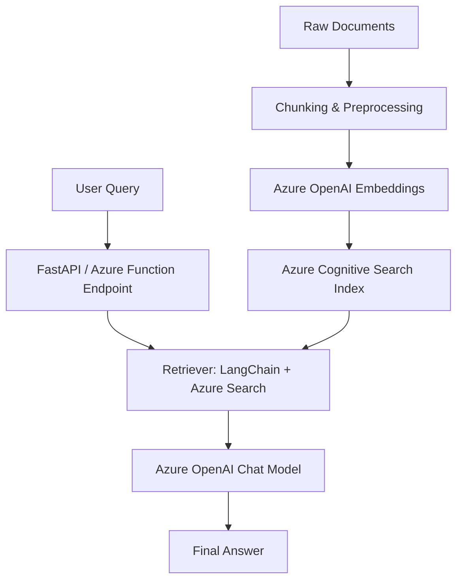

# 📖 RAG Q&A System with Azure OpenAI, LangChain & Azure Functions

## 🌟 Project Overview
In this project, I built a **Retrieval-Augmented Generation (RAG) Question-Answering System** that allows users to ask any natural language question and receive precise answers generated by **Azure OpenAI GPT models**.  

The idea is simple but powerful:  
- Documents are processed into **chunks**.  
- Each chunk is converted into **vector embeddings** using Azure OpenAI.  
- These embeddings are stored in **Azure Cognitive Search** (vector database).  
- When a user asks a question, the system retrieves the most relevant chunks and passes them to GPT, which generates a **context-aware answer**.  
- The solution was first tested locally with **FastAPI**, then deployed to production with **Azure Functions** for serverless scalability.  

This simulates how modern AI-powered applications retrieve and reason over private data, rather than relying only on the model’s memory.

## 🏗️ Architecture Overview

---

## 🏗️ End-to-End Architecture

## LLM Development Approaches: LangChain vs Azure AI No-Code

### With LangChain (Code-Driven)
- **Approach:** Code pipeline → preprocessing → embeddings → vector storage → retrieval → LLM
- **Pros:** Maximum flexibility (custom prompts, embeddings, multi-step logic), portable across Azure, GCP, AWS, or on-prem
- **Cons:** Slower development, requires coding & API management, manual scaling and CI/CD

### Without LangChain (Azure AI No-Code)
- **Approach:** No-code pipeline using Blob Storage, Cognitive Search, and OpenAI
- **Pros:** Fast development and deployment, built-in scaling & monitoring
- **Cons:** Limited flexibility, partial vendor lock-in

**Summary:**  
- **LangChain:** Flexibility + Portability  
- **Azure AI No-Code:** Speed + Simplicity

    cons:
      - "Limited flexibility and custom logic"
      - "Partial vendor lock-in"
summary:
  langchain: "Flexibility + Portability"
  azure_ai_no_code: "Speed + Simplicity"

